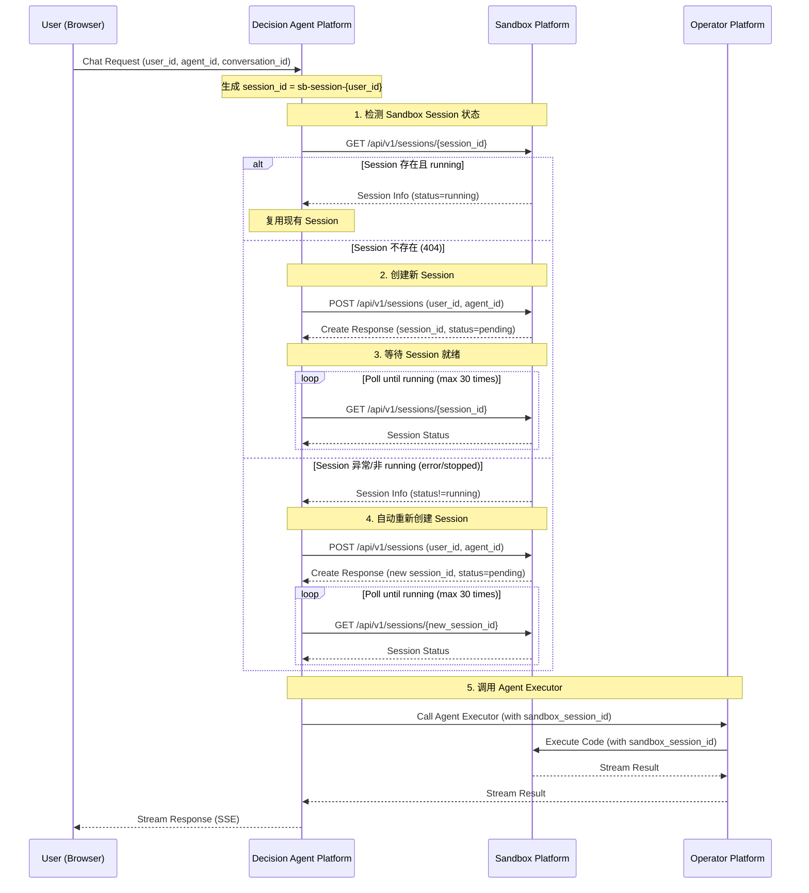
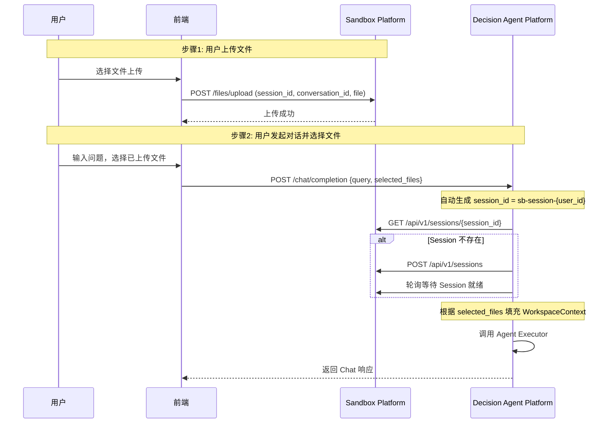

## 0. 目标与范围（再次明确）

### 0.1 核心目标
在 **Decision Agent Platform** 中实现 **Agent 临时区（Sandbox Workspace）**，用于：

1. 用户在指定 Agent + Conversation 下上传文件（通过 Sandbox Platform 接口）
2. 用户可查看文件列表、下载文件（通过 Sandbox Platform 接口）
3. Agent 在对话中基于文件路径生成代码并在 Sandbox Platform 内执行
4. Agent 与 Sandbox 的交互由 **算子平台注册的工具**完成
5. 整个过程采用 **LLM React loop**，支持流式输出

### 0.2 约束
+ 文件作用域：`(agent_id, conversation_id)`
+ 文件路径必须是 **真实沙箱路径**（Agent 生成的代码必须可执行）
+ 仅展示用户上传文件（Agent 生成文件不展示）
+ Conversation 删除立即清理文件，不可恢复
+ 跨 Conversation 文件引用不支持
+ 存储与沙箱内部对象存储不暴露给外部系统

---

# 1. C4 架构设计（概念级）

## 1.1 Context 图


**Decision Agent Platform（DAP）**

+ 负责 Agent 对话与 React Loop
+ 负责与 Operator Platform 交互
+ 管理 Sandbox Session 生命周期（直接调用 Sandbox Platform）
+ 在 Chat 流程中自动检查/创建 Sandbox Session

**Operator Platform（OP）**

+ 工具注册中心（Tool Registry）
+ 代理工具调用（Invoke）
+ 将沙箱能力封装成工具，供 DAP 调用

**Sandbox Platform（SP）**

+ 负责 Session、Execution、File Upload/List/Download（接口已存在）
+ 对外暴露的能力只通过接口，不暴露内部存储

---

## 1.2 Container 图


---

## 1.3 Chat 流程中 Sandbox Session 管理图



---

# 2. 核心概念设计

## 2.1 Sandbox Session（用户沙箱会话）

### 定义

每个用户有且只有一个 Sandbox Session，该用户下的所有 Agent 和所有 Conversation 共享同一个 Session，Session 跟随用户生命周期。

### Session ID 生成规则

- **格式**：`sb-session-{user_id}`
- **示例**：`sb-session-user123`
- **固定性**：同一用户始终使用相同的 Session ID
- **共享性**：同一用户下的所有 Agent 和所有 Conversation 共享同一个 Sandbox Session
- **无需缓存**：每次 Chat 都基于 `user_id` 生成相同的 Session ID

### 生命周期管理

1. **检测时机**：用户发起 Chat 请求时
2. **检测方式**：调用 Sandbox Platform API 直接检测 Session 状态
3. **自动创建**：如果 Session 不存在或异常，自动创建新 Session
4. **等待就绪**：创建新 Session 后，轮询等待状态变为 `running`
5. **复用逻辑**：如果 Session 存在且状态为 `running`，直接复用

### 无需持久化存储

- 不使用数据库存储 Session 映射关系
- 不使用 Redis 缓存
- 不使用 sync.Map 内存缓存
- Session ID 直接由 `user_id` 生成，每次都相同

---

## 2.2 Workspace File（临时区文件）

### 文件路径结构（Sandbox Platform 内部）

```
/workspace/
└── uploads/
    └── {sandbox_session_id}/
        └── {conversation_id}/
            └── temparea/              # 【新增】临时区上传的文件目录
                ├── data.csv
                ├── model.pkl
                └── config.json
```

### 路径说明

| 路径层级 | 说明 |
|---------|------|
| `uploads` | Sandbox Platform 固定目录 |
| `{sandbox_session_id}` | Sandbox Platform 返回的 Session ID |
| `{conversation_id}` | Conversation ID |
| `temparea` | **固定目录名**，用于区分用户上传文件与其他类型文件 |
| `*.csv, *.pkl, ...` | 用户上传的文件 |

### Agent 代码引用示例

```python
# Agent 生成的代码中引用用户上传的文件
import pandas as pd

# Sandbox Platform 会根据 sandbox_session_id 和 conversation_id 自动映射路径
# Agent 只需要使用约定路径即可
df = pd.read_csv('/workspace/uploads/temparea/data.csv')
```

---

# 3. 核心流程设计

## 3.1 Chat 流程中集成 Sandbox Session 管理

### 关键代码位置

在 `src/domain/service/agentrunsvc/chat.go` 的 `Chat` 函数中，第 122-126 行（HandleGetInfoOrCreate 之后）添加：

```go
// NOTE: 确保 Sandbox Session 存在并就绪
sessionID := fmt.Sprintf("sb-session-%s", req.UserID)
sandboxSessionID, err := agentSvc.EnsureSandboxSession(ctx, sessionID, req)
if err != nil {
    o11y.Error(newCtx, fmt.Sprintf("[chat] ensure sandbox session failed: %v", err))
    return nil, err
}

// 将 sandbox_session_id 传递给 Agent Executor
req.SandboxSessionID = sandboxSessionID
```

---

## 3.2 EnsureSandboxSession 函数实现

### 完整实现

```go
// 在 src/domain/service/agentrunsvc/ensure_sandbox_session.go 中新增

package agentsvc

import (
    "context"
    "fmt"
    "strings"
    "time"

    "github.com/kweaver-ai/decision-agent/agent-factory/src/drivenadapter/httpaccess/sandboxplatformhttp/sandboxplatformdto"
    agentreq "github.com/kweaver-ai/decision-agent/agent-factory/src/driveradapter/api/rdto/agent/req"
    o11y "github.com/kweaver-ai/kweaver-go-lib/observability"
    "github.com/pkg/errors"
)

// EnsureSandboxSession 确保 Sandbox Session 存在并就绪
// 完全移除 sync.Map 缓存，每次直接调用 Sandbox Platform 检测
func (s *agentSvc) EnsureSandboxSession(ctx context.Context, sessionID string, req *agentreq.ChatReq) (string, error) {
    ctx, _ = o11y.StartInternalSpan(ctx)
    defer o11y.EndSpan(ctx, nil)

    o11y.SetAttributes(ctx,
        o11y.String("session_id", sessionID),
        o11y.String("user_id", req.UserID),
        o11y.String("agent_id", req.AgentID),
    )

    // 1. 检测 Session 状态
    sessionInfo, err := s.sandboxPlatform.GetSession(ctx, sessionID)
    if err != nil {
        // 404 错误表示 Session 不存在，继续创建
        if s.isSessionNotFoundError(err) {
            o11y.SetAttributes(ctx, o11y.String("action", "create_new"))
            return s.createNewSession(ctx, sessionID, req)
        }
        
        // 其他错误：尝试创建新 Session
        o11y.SetAttributes(ctx, o11y.String("action", "recover_from_error"))
        s.logger.Warnf("[EnsureSandboxSession] get session failed: %v, will create new session", err)
        return s.createNewSession(ctx, sessionID, req)
    }

    // 2. 检查 Session 状态
    if sessionInfo.Status == "running" {
        o11y.SetAttributes(ctx, o11y.String("action", "reuse_existing"))
        s.logger.Infof("[EnsureSandboxSession] reuse existing session: %s", sessionID)
        return sessionID, nil
    }

    // 3. Session 状态非 running，自动重新创建
    o11y.SetAttributes(ctx, o11y.String("action", "recreate"))
    s.logger.Warnf("[EnsureSandboxSession] session status is %s, will recreate: %s", sessionInfo.Status, sessionID)
    return s.createNewSession(ctx, sessionID, req)
}

// createNewSession 创建新的 Sandbox Session
func (s *agentSvc) createNewSession(ctx context.Context, sessionID string, req *agentreq.ChatReq) (string, error) {
    createReq := sandboxplatformdto.CreateSessionReq{
        UserID:           req.UserID,
        AgentID:          req.AgentID,
        BusinessDomainID: req.XBusinessDomainID,
        Config: map[string]interface{}{
            "session_id": sessionID, // 使用预生成的 session_id
            "file_upload_config": map[string]interface{}{
                "max_file_size":      s.sandboxPlatformConf.DefaultFileUploadConfig.MaxFileSize,
                "max_file_size_unit": s.sandboxPlatformConf.DefaultFileUploadConfig.MaxFileSizeUnit,
                "max_file_count":     s.sandboxPlatformConf.DefaultFileUploadConfig.MaxFileCount,
                "allowed_file_types": s.sandboxPlatformConf.DefaultFileUploadConfig.AllowedFileTypes,
            },
        },
    }

    createResp, err := s.sandboxPlatform.CreateSession(ctx, createReq)
    if err != nil {
        // 检查是否为 "已存在" 错误（并发场景下其他请求已创建）
        if s.isSessionAlreadyExistsError(err) {
            s.logger.Infof("[createNewSession] session already exists: %s, will wait for ready", sessionID)
            // 直接等待现有 Session 就绪
            return s.waitForSessionReady(ctx, sessionID)
        }

        s.logger.Errorf("[createNewSession] create failed: %v", err)
        return "", errors.Wrap(err, "create sandbox session failed")
    }

    // 使用返回的 session_id（可能与请求的预生成 ID 不同）
    actualSessionID := createResp.SessionID
    if createResp.SessionID == "" {
        actualSessionID = sessionID
    }

    // 等待 Session 就绪
    return s.waitForSessionReady(ctx, actualSessionID)
}

// waitForSessionReady 等待 Session 就绪
func (s *agentSvc) waitForSessionReady(ctx context.Context, sessionID string) (string, error) {
    maxRetries := s.sandboxPlatformConf.MaxRetries
    retryInterval := s.sandboxPlatformConf.RetryInterval

    for i := 0; i < maxRetries; i++ {
        sessionInfo, err := s.sandboxPlatform.GetSession(ctx, sessionID)
        if err != nil {
            s.logger.Errorf("[waitForSessionReady] get session status failed (attempt %d): %v", i+1, err)
            time.Sleep(retryInterval)
            continue
        }

        if sessionInfo.Status == "running" {
            s.logger.Infof("[waitForSessionReady] session ready: %s (attempts: %d)", sessionID, i+1)
            return sessionID, nil
        }

        // 如果状态是 error/stopped，直接失败
        if sessionInfo.Status == "error" || sessionInfo.Status == "stopped" {
            return "", errors.Errorf("session in invalid state: %s", sessionInfo.Status)
        }

        time.Sleep(retryInterval)
    }

    return "", errors.New("timeout waiting for session ready")
}

// isSessionNotFoundError 判断是否为 Session 不存在的错误
func (s *agentSvc) isSessionNotFoundError(err error) bool {
    // 检查是否为 rest.HTTPError 类型
    var httpErr *rest.HTTPError
    if errors.As(err, &httpErr) {
        return httpErr.StatusCode == http.StatusNotFound
    }
    return false
}

// isSessionAlreadyExistsError 判断是否为 Session 已存在的错误
func (s *agentSvc) isSessionAlreadyExistsError(err error) bool {
    var httpErr *rest.HTTPError
    if errors.As(err, &httpErr) {
        return httpErr.StatusCode == http.StatusConflict // 409 Conflict
    }
    return strings.Contains(err.Error(), "already exists")
}
```

---

# 4. DDD 层次设计（简化版）

## 4.1 目录结构

```
src/
├── drivenadapter/
│   └── httpaccess/
│       └── sandboxplatformhttp/
│           ├── define.go
│           ├── create_session.go
│           ├── get_session.go
│           └── delete_session.go
└── domain/service/
    └── agentrunsvc/
        ├── chat.go
        ├── ensure_sandbox_session.go  # 【新增】
        ├── common.go
        └── define.go
```

---

## 4.2 Sandbox Platform HTTP 客户端

### 接口定义

**port/driven/ihttpaccess/isandboxplatformhttp/sandbox_platform.go**：

```go
package isandboxplatformhttp

import (
    "context"
    sandboxdto "github.com/kweaver-ai/decision-agent/agent-factory/src/drivenadapter/httpaccess/sandboxplatformhttp/sandboxplatformdto"
)

// ISandboxPlatform Sandbox Platform 接口
type ISandboxPlatform interface {
    // CreateSession 创建 Sandbox Session
    CreateSession(ctx context.Context, req sandboxdto.CreateSessionReq) (*sandboxdto.CreateSessionResp, error)
    // GetSession 获取 Sandbox Session 信息
    GetSession(ctx context.Context, sessionID string) (*sandboxdto.GetSessionResp, error)
    // DeleteSession 删除 Sandbox Session
    DeleteSession(ctx context.Context, sessionID string) error
    // DeleteConversationFiles 删除指定 Conversation 的文件
    DeleteConversationFiles(ctx context.Context, sessionID, conversationID string) error
    // ListFiles 列出指定目录下的文件
    ListFiles(ctx context.Context, sessionID, conversationID, subdir string) ([]string, error)
}
```

---

### DTO 定义

**drivenadapter/httpaccess/sandboxplatformhttp/sandboxplatformdto/req.go**：

```go
package sandboxplatformdto

// CreateSessionReq 创建 Session 请求
type CreateSessionReq struct {
    UserID           string                 `json:"user_id"`
    AgentID          string                 `json:"agent_id"`
    BusinessDomainID string                 `json:"business_domain_id"`
    Config           map[string]interface{} `json:"config,omitempty"`
}
```

**drivenadapter/httpaccess/sandboxplatformhttp/sandboxplatformdto/resp.go**：

```go
package sandboxplatformdto

// CreateSessionResp 创建 Session 响应
type CreateSessionResp struct {
    SessionID string                 `json:"session_id"`
    Status    string                 `json:"status"`
    CreatedAt int64                  `json:"created_at"`
    TTL       int64                  `json:"ttl"`
    Info      map[string]interface{} `json:"info,omitempty"`
}

// GetSessionResp 获取 Session 响应
type GetSessionResp struct {
    SessionID string `json:"session_id"`
    Status    string `json:"status"` // pending/running/stopped
    CreatedAt int64  `json:"created_at"`
    TTL       int64  `json:"ttl"`
}
```

---

### HTTP 客户端实现

**drivenadapter/httpaccess/sandboxplatformhttp/create_session.go**：

```go
package sandboxplatformhttp

import (
    "context"
    "fmt"

    sandboxdto "github.com/kweaver-ai/decision-agent/agent-factory/src/drivenadapter/httpaccess/sandboxplatformhttp/sandboxplatformdto"
    "github.com/kweaver-ai/decision-agent/agent-factory/conf"
    "github.com/kweaver-ai/decision-agent/agent-factory/src/infra/cmp/httpclient"
    "github.com/kweaver-ai/decision-agent/agent-factory/src/infra/cmp/icmp"
    "github.com/kweaver-ai/decision-agent/agent-factory/src/infra/common/cutil"
    o11y "github.com/kweaver-ai/kweaver-go-lib/observability"
    "github.com/pkg/errors"
)

func (svc *sandboxPlatformHttpAcc) CreateSession(ctx context.Context, req sandboxdto.CreateSessionReq) (*sandboxdto.CreateSessionResp, error) {
    ctx, _ = o11y.StartInternalSpan(ctx)
    defer o11y.EndSpan(ctx, nil)

    url := fmt.Sprintf("%s/api/v1/sessions",
        cutil.GetHTTPAccess(svc.sandboxPlatformConf.Svc.Host, svc.sandboxPlatformConf.Svc.Port, svc.sandboxPlatformConf.Svc.Protocol))

    var resp sandboxdto.CreateSessionResp
    err := svc.httpClient.Post(ctx, url, req, &resp)
    if err != nil {
        return nil, errors.Wrap(err, "create sandbox session failed")
    }

    return &resp, nil
}
```

**drivenadapter/httpaccess/sandboxplatformhttp/get_session.go**：

```go
package sandboxplatformhttp

import (
    "context"
    "fmt"

    sandboxdto "github.com/kweaver-ai/decision-agent/agent-factory/src/drivenadapter/httpaccess/sandboxplatformhttp/sandboxplatformdto"
    "github.com/kweaver-ai/decision-agent/agent-factory/src/infra/cmp/httpclient"
    o11y "github.com/kweaver-ai/kweaver-go-lib/observability"
    "github.com/pkg/errors"
)

func (svc *sandboxPlatformHttpAcc) GetSession(ctx context.Context, sessionID string) (*sandboxdto.GetSessionResp, error) {
    ctx, _ = o11y.StartInternalSpan(ctx)
    defer o11y.EndSpan(ctx, nil)

    url := fmt.Sprintf("%s/api/v1/sessions/%s",
        svc.sandboxPlatformConf.BaseURL, sessionID)

    var resp sandboxdto.GetSessionResp
    err := svc.httpClient.Get(ctx, url, nil, &resp)
    if err != nil {
        return nil, errors.Wrap(err, "get sandbox session failed")
    }

    return &resp, nil
}
```

**drivenadapter/httpaccess/sandboxplatformhttp/define.go**：

```go
package sandboxplatformhttp

import (
    "sync"

    "github.com/kweaver-ai/decision-agent/agent-factory/conf"
    "github.com/kweaver-ai/decision-agent/agent-factory/src/infra/cmp/httpclient"
    "github.com/kweaver-ai/decision-agent/agent-factory/src/infra/cmp/icmp"
    "github.com/kweaver-ai/decision-agent/agent-factory/src/infra/common/cutil"
)

type sandboxPlatformHttpAcc struct {
    logger                icmp.Logger
    httpClient            httpclient.HTTPClient
    sandboxPlatformConf   *conf.SandboxPlatformConf
    baseURL              string
}

var (
    sandboxPlatformOnce sync.Once
    sandboxPlatformImpl ISandboxPlatform
)

func NewSandboxPlatformHttpAcc(sandboxPlatformConf *conf.SandboxPlatformConf, httpClient httpclient.HTTPClient, logger icmp.Logger) ISandboxPlatform {
    sandboxPlatformOnce.Do(func() {
        sandboxPlatformImpl = &sandboxPlatformHttpAcc{
            logger:              logger,
            httpClient:          httpClient,
            sandboxPlatformConf:  sandboxPlatformConf,
            baseURL:             cutil.GetHTTPAccess(sandboxPlatformConf.Svc.Host, sandboxPlatformConf.Svc.Port, sandboxPlatformConf.Svc.Protocol),
        }
    })
    return sandboxPlatformImpl
}
```

---

## 4.3 Conversation 删除时的文件清理

### 删除流程

在 `src/drivenadapter/dbaccess/conversationdbacc/delete.go` 的删除逻辑中增加 Hook：

```go
// 在 src/drivenadapter/dbaccess/conversationdbacc/delete.go 中
// 需要导入: "context", "fmt", "time"

func (acc *conversationDBAcc) Delete(ctx context.Context, req conversationdto.DeleteReq) error {
    // 1. 执行数据库软删除
    err := acc.db.Delete(...)
    if err != nil {
        return err
    }

    // 2. 异步清理 Sandbox Workspace 文件（带超时和重试）
    go func() {
        // 带超时的 context，防止清理操作无限期执行
        cleanupCtx, cancel := context.WithTimeout(context.Background(), 30*time.Second)
        defer cancel()

        sessionID := fmt.Sprintf("sb-session-%s", req.UserID)

        // 重试机制（最多 3 次，指数退避）
        var lastErr error
        for i := 0; i < 3; i++ {
            if err := acc.sandboxPlatform.DeleteConversationFiles(cleanupCtx, sessionID, req.ConversationID); err != nil {
                lastErr = err
                logger.Warnf("[DeleteConversation] cleanup attempt %d failed: %v", i+1, err)
                time.Sleep(time.Second * time.Duration(i+1)) // 指数退避: 1s, 2s, 3s
                continue
            }
            logger.Infof("[DeleteConversation] cleanup success: %s/%s", sessionID, req.ConversationID)
            return
        }

        // 所有重试失败，记录到持久化存储以便后续处理
        logger.Errorf("[DeleteConversation] cleanup failed after retries: %v", lastErr)

        // TODO: 将清理任务写入队列/数据库，由定时任务重试
        // 例如：acc.cleanupQueue.Enqueue(CleanupTask{SessionID: sessionID, ConversationID: req.ConversationID})
    }()

    return nil
}
```

### 设计考虑
- **异步执行**：文件清理不阻塞 Conversation 删除操作
- **超时控制**：使用 `context.WithTimeout` 防止清理操作无限期执行（30秒超时）
- **重试机制**：最多重试 3 次，采用指数退避策略（1s, 2s, 3s）
- **幂等性**：多次调用 `DeleteConversationFiles` 应该是安全的
- **持久化重试**：所有重试失败后，应将清理任务写入队列/数据库，由定时任务处理
- **应用重启容错**：即使应用重启，未完成的清理任务仍可由定时任务重试

---

# 5. 配置设计

## 5.1 Sandbox Platform 配置

**conf/sandbox_platform.go**：

```go
package conf

import "github.com/kweaver-ai/decision-agent/agent-factory/cconf"

// SandboxPlatformConf Sandbox Platform 配置
type SandboxPlatformConf struct {
    SvcConf                      cconf.SvcConf      `yaml:"svc"`
    DefaultTTL                   int64               `yaml:"default_ttl"`     // 默认 Session TTL（秒）
    MaxRetries                   int                 `yaml:"max_retries"`     // 等待 Session 就绪的最大重试次数
    RetryInterval                string              `yaml:"retry_interval"`  // 重试间隔（如 "500ms"）
    DefaultFileUploadConfig      FileUploadConfig    `yaml:"file_upload_config"`
}

// FileUploadConfig 文件上传配置
type FileUploadConfig struct {
    MaxFileSize      int64    `yaml:"max_file_size"`      // 最大文件大小（数值）
    MaxFileSizeUnit  string   `yaml:"max_file_size_unit"` // 单位：KB/MB/GB
    MaxFileCount     int      `yaml:"max_file_count"`     // 最大文件数量
    AllowedFileTypes []string `yaml:"allowed_file_types"` // 允许的文件类型
}
```

---

## 5.2 配置文件示例

**agent-factory.yaml**：

```yaml
sandbox_platform:
  svc:
    host: "sandbox-platform.kweaver.svc.cluster.local"
    port: 9100
    protocol: "http"
  default_ttl: 7200              # 默认 2 小时
  max_retries: 30                 # 最多重试 30 次
  retry_interval: "500ms"         # 每次间隔 500ms
  file_upload_config:
    max_file_size: 100
    max_file_size_unit: "MB"
    max_file_count: 50
    allowed_file_types:
      - "csv"
      - "xlsx"
      - "json"
      - "txt"
      - "pkl"
      - "png"
      - "jpg"
      - "pdf"
```

---

# 6. 前端集成指南

## 6.1 前端如何获取 Sandbox Session ID

### Session ID 生成规则

Session ID 基于 `user_id` 生成，前后端使用相同的规则即可：

```typescript
// 前端生成 Session ID
function generateSessionId(userId: string): string {
    return `sb-session-${userId}`;
}

// 示例
const sessionId = generateSessionId('user123');
// 结果: "sb-session-user123"
```

### 使用方式

前端在上传文件时，使用相同的 Session ID 生成规则即可：

```typescript
// 上传文件
async function uploadFile(userId: string, conversationId: string, file: File) {
    const sessionId = generateSessionId(userId);

    const formData = new FormData();
    formData.append('file', file);
    formData.append('conversation_id', conversationId);
    formData.append('subdir', 'temparea');

    const response = await fetch(
        `${SANDBOX_API_URL}/api/v1/sessions/${sessionId}/files/upload`,
        {
            method: 'POST',
            body: formData,
        }
    );

    return response.json();
}
```

### 关键要点

- **无需从 Decision Agent 获取 Session ID**
- **前后端使用相同的生成规则**
- **格式**：`sb-session-{user_id}`
- **固定性**：同一用户始终使用相同的 Session ID
- **共享性**：同一用户下的所有 Agent 和 Conversation 共享同一个 Session

---

## 6.2 上传文件到 Sandbox

```typescript
interface UploadFileOptions {
  sandboxSessionId: string;
  conversationId: string;
  file: File;
}

async function uploadFile(options: UploadFileOptions): Promise<any> {
  const { sandboxSessionId, conversationId, file } = options;
  const formData = new FormData();
  formData.append('file', file);
  formData.append('conversation_id', conversationId);
  formData.append('subdir', 'temparea'); // 指定子目录为 temparea

  const response = await fetch(
    `${SANDBOX_API_URL}/api/v1/sessions/${sandboxSessionId}/files/upload`,
    {
      method: 'POST',
      body: formData,
    }
  );

  if (!response.ok) {
    throw new Error(`Upload failed: ${response.statusText}`);
  }

  return response.json();
}

// 使用示例
const sandboxSessionId = await chatWithSandboxSession('agent123', '上传一个文件分析');

await uploadFile({
  sandboxSessionId: sandboxSessionId,
  conversationId: 'conv456',
  file: selectedFile,
});
```

---

## 6.3 列出临时区文件

```typescript
interface ListFilesOptions {
  sandboxSessionId: string;
  conversationId: string;
}

async function listTempAreaFiles(options: ListFilesOptions): Promise<string[]> {
  const { sandboxSessionId, conversationId } = options;

  const response = await fetch(
    `${SANDBOX_API_URL}/api/v1/sessions/${sandboxSessionId}/files`,
    {
      method: 'GET',
      headers: {
        'conversation_id': conversationId,
        'subdir': 'temparea', // 只列出 temparea 目录下的文件
      },
    }
  );

  if (!response.ok) {
    throw new Error(`List files failed: ${response.statusText}`);
  }

  const data = await response.json();
  return data.files; // ["data.csv", "model.pkl", ...]
}

// 使用示例
const files = await listTempAreaFiles({
  sandboxSessionId: sandboxSessionId,
  conversationId: 'conv456',
});

console.log('Uploaded files:', files);
```

---

## 6.4 下载文件

```typescript
interface DownloadFileOptions {
  sandboxSessionId: string;
  fileName: string;
}

async function downloadFile(options: DownloadFileOptions): Promise<void> {
  const { sandboxSessionId, fileName } = options;

  const response = await fetch(
    `${SANDBOX_API_URL}/api/v1/sessions/${sandboxSessionId}/files/${fileName}`,
    {
      method: 'GET',
    }
  );

  if (!response.ok) {
    throw new Error(`Download failed: ${response.statusText}`);
  }

  const blob = await response.blob();
  const url = window.URL.createObjectURL(blob);
  const a = document.createElement('a');
  a.href = url;
  a.download = fileName;
  document.body.appendChild(a);
  a.click();
  document.body.removeChild(a);
  window.URL.revokeObjectURL(url);
}

// 使用示例
await downloadFile({
  sandboxSessionId: sandboxSessionId,
  fileName: 'data.csv',
});
```

---

# 7. Agent 代码执行集成

## 7.1 传递 Sandbox Session ID 给 Agent Executor

### 修改 ChatReq DTO

**driveradapter/api/rdto/agent/req/chat_req.go**：

```go
package req

// SelectedFile 用户选择的临时区文件
type SelectedFile struct {
    FileName string `json:"file_name" validate:"required"` // 文件名
    // 注：完整路径为 /workspace/uploads/temparea/{file_name}
}

type ChatReq struct {
    // ... 现有字段 ...

    // SelectedFiles 用户选择的临时区文件（新增）
    // 用户上传文件后，可以在对话时选择哪些文件参与本次对话
    SelectedFiles []SelectedFile `json:"selected_files,omitempty"`
}
```

**字段说明**：

| 字段 | 类型 | 必填 | 说明 |
|------|------|------|------|
| `selected_files` | array | 否 | 用户选择的临时区文件列表 |

**SelectedFile 结构**：

| 字段 | 类型 | 必填 | 说明 |
|------|------|------|------|
| `file_name` | string | 是 | 文件名（不含路径） |

**使用场景**：

1. 用户先通过 Sandbox Platform API 上传文件到临时区
2. 用户发起对话时，可以选择已上传的文件参与本次对话
3. 前端将选中的文件名通过 `selected_files` 参数传递给后端
4. 后端将文件信息注入到 Agent 的 WorkspaceContext 中

### 修改 GenerateAgentCallReq 函数

**domain/service/agentrunsvc/chat_req.go**：

在 `GenerateAgentCallReq` 函数中，添加 Sandbox Session ID 到请求参数：

```go
func (agentSvc *agentSvc) GenerateAgentCallReq(
    ctx context.Context,
    req *agentreq.ChatReq,
    contexts []*comvalobj.LLMMessage,
    agent *agentfactorydto.Agent,
) (*v2agentexecutordto.V2AgentCallReq, error) {
    // ... 现有代码 ...

    agentCallReq := v2agentexecutordto.V2AgentCallReq{
        // ... 其他字段 ...
        SandboxSessionID: req.SandboxSessionID, // 新增
    }

    return agentCallReq, nil
}
```

---

## 7.2 Agent Executor 使用 Sandbox Session ID

Agent Executor 在调用 Sandbox Platform 代码执行工具时，自动使用传递的 `sandbox_session_id`，确保在正确的 Session 环境中执行代码。

### Agent 代码示例

```python
# Agent 生成的代码中引用用户上传的文件
import pandas as pd

# 文件路径格式：/workspace/uploads/temparea/{filename}
# Sandbox Platform 会根据 sandbox_session_id 和 conversation_id 自动映射路径
# Agent 只需要使用约定路径即可

# 读取用户上传的文件
df = pd.read_csv('/workspace/uploads/temparea/data.csv')
print(df.head())

# 处理数据
result = df.describe()

# Agent 生成结果文件（可选，不在 temparea 目录）
with open('/workspace/uploads/result.json', 'w') as f:
    f.write(result.to_json())
```

### 路径映射说明

Sandbox Platform 内部会自动进行路径映射：

| Agent 使用的路径 | Sandbox Platform 实际路径 |
|----------------|--------------------------|
| `/workspace/uploads/temparea/data.csv` | `/workspace/uploads/{sandbox_session_id}/{conversation_id}/temparea/data.csv` |

Agent 无需知道完整的物理路径，只需使用约定路径即可。

---

## 7.3 WorkspaceContext：文件信息传递

### 目的
让 Agent 知道当前可用的文件列表，无需执行 ls 命令。

### 数据结构

```go
// WorkspaceFile 工作区文件信息
type WorkspaceFile struct {
    FileName string `json:"file_name"` // 文件名
    FilePath string `json:"file_path"` // 完整路径
}

// WorkspaceContext 工作区上下文
type WorkspaceContext struct {
    RootPath  string          `json:"root_path"`  // 临时区根路径
    Files     []WorkspaceFile `json:"files"`      // 可用文件列表
}

// 在 V2AgentCallReq 中增加字段
type V2AgentCallReq struct {
    // ... 现有字段 ...

    // WorkspaceContext 工作区上下文（新增）
    WorkspaceContext *WorkspaceContext `json:"workspace_context,omitempty"`
}
```

**注**：由于 `ListFiles` API 仅返回文件名列表，不包含文件大小信息，因此 `WorkspaceFile` 结构体不包含 `FileSize` 字段。

### 填充逻辑

在 `GenerateAgentCallReq` 函数中：

```go
func (agentSvc *agentSvc) GenerateAgentCallReq(
    ctx context.Context,
    req *agentreq.ChatReq,
    contexts []*comvalobj.LLMMessage,
    agent *agentfactorydto.Agent,
) (*v2agentexecutordto.V2AgentCallReq, error) {
    // ... 现有代码 ...

    // 获取文件列表
    sessionID := fmt.Sprintf("sb-session-%s", req.UserID)
    files, err := agentSvc.sandboxPlatform.ListFiles(ctx, sessionID, req.ConversationID, "temparea")
    if err != nil {
        agentSvc.logger.Warnf("[GenerateAgentCallReq] list files failed: %v", err)
        files = []string{} // 失败时使用空列表
    }

    // 构建文件信息
    workspaceFiles := make([]v2agentexecutordto.WorkspaceFile, 0, len(files))
    for _, file := range files {
        workspaceFiles = append(workspaceFiles, v2agentexecutordto.WorkspaceFile{
            FileName: file,
            FilePath: fmt.Sprintf("/workspace/uploads/temparea/%s", file),
        })
    }

    agentCallReq := v2agentexecutordto.V2AgentCallReq{
        // ... 其他字段 ...
        SandboxSessionID: req.SandboxSessionID,
        WorkspaceContext: &v2agentexecutordto.WorkspaceContext{
            RootPath: "/workspace/uploads/temparea/",
            Files:    workspaceFiles,
        },
    }

    return agentCallReq, nil
}
```

### Agent Prompt 注入

在 Agent Executor 中，将 WorkspaceContext 转换为 System Prompt 片段：

```python
# Agent Executor 端的 Prompt 模板
workspace_info = ""
if workspace_context:
    files_info = "\n".join([
        f"- {f['file_name']} ({f['file_path']})"
        for f in workspace_context['files']
    ])
    workspace_info = f"""
You have access to user-uploaded files in the workspace.
Workspace root: {workspace_context['root_path']}

Available files:
{files_info}
"""

system_prompt = base_prompt + workspace_info
```

---

# 8. 关键实现注意点

## 8.1 并发控制

### 并发场景处理

当多个 Chat 请求同时到达时，可能出现以下情况：

```go
// 场景：用户同时发起 3 个 Chat 请求
// Request 1: GetSession(404) -> CreateSession -> Wait -> Success
// Request 2: GetSession(404) -> CreateSession -> Wait -> ?
// Request 3: GetSession(404) -> CreateSession -> Wait -> ?
```

**Request 2/3 可能遇到**：
1. CreateSession 返回 "already exists" 错误（409 Conflict）
2. CreateSession 成功但返回的是相同的 session_id
3. CreateSession 卡在 pending 状态

**处理策略**：

- **Session ID 固定**：同一用户始终使用相同的 Session ID
- **直接检测状态**：每次 Chat 都调用 Sandbox Platform API 检测
- **优雅处理冲突**：通过 `isSessionAlreadyExistsError` 检测 409 Conflict 错误
  - 如果检测到 "已存在" 错误，直接调用 `waitForSessionReady` 等待现有 Session 就绪
  - 避免因并发创建导致的失败
- **提取等待逻辑**：独立的 `waitForSessionReady` 函数供多种场景复用

### Sandbox Platform 需保证的幂等性

Sandbox Platform 的 `POST /api/v1/sessions` API 应该保证：
- 如果 `session_id` 已存在且状态正常，返回 409 Conflict 或现有 Session 信息
- 如果 `session_id` 不存在，创建新 Session
- 如果 `session_id` 存在但状态异常，可以选择：
  - 返回错误，由 Decision Agent 重新创建（使用新的 session_id）
  - 自动恢复 Session 到可用状态

---

## 8.2 错误处理

### Sandbox Platform 创建失败

```go
createResp, err := s.sandboxPlatform.CreateSession(ctx, createReq)
if err != nil {
    o11y.Error(ctx, fmt.Sprintf("[EnsureSandboxSession] create failed: %v", err))
    return "", rest.NewHTTPError(ctx, http.StatusInternalServerError,
        apierr.AgentAPP_SandboxSessionCreateFailed).
        WithErrorDetails("Failed to create sandbox session")
}
```

### Session 就绪超时

```go
if !sessionReady {
    o11y.Error(ctx, "[EnsureSandboxSession] session not ready after retries")
    return "", rest.NewHTTPError(ctx, http.StatusServiceUnavailable,
        apierr.AgentAPP_SandboxSessionNotReady).
        WithErrorDetails("Sandbox session initialization timeout")
}
```

### 轮询验证失败

```go
sessionInfo, err := s.sandboxPlatform.GetSession(ctx, sessionID)
if err != nil {
    o11y.Error(ctx, fmt.Sprintf("[EnsureSandboxSession] get session failed: %v", err))
    // 继续执行，尝试创建新 Session
}
```

---

## 8.3 日志与追踪

### OpenTelemetry 追踪

```go
func (s *agentSvc) EnsureSandboxSession(ctx context.Context, sessionID string, req *agentreq.ChatReq) (string, error) {
    ctx, _ = o11y.StartInternalSpan(ctx)
    defer o11y.EndSpan(ctx, nil)

    // 设置属性
    o11y.SetAttributes(ctx,
        o11y.String("session_id", sessionID),
        o11y.String("user_id", req.UserID),
        o11y.String("agent_id", req.AgentID),
        o11y.String("business_domain_id", req.XBusinessDomainID),
    )

    // ... 执行逻辑 ...

    return sessionID, nil
}
```

### 关键日志

```go
// 复用现有 Session
s.logger.Infof("[EnsureSandboxSession] reuse existing session: %s", sessionID)

// 创建新 Session
s.logger.Infof("[EnsureSandboxSession] create new sandbox session: %s", createResp.SessionID)

// Session 就绪
s.logger.Infof("[EnsureSandboxSession] sandbox session ready: %s (attempts: %d)", sessionID, attempts)
```

---

## 8.4 清理策略

### 无需主动清理

由于不使用任何缓存机制，无需主动清理 Session 映射：

- **无缓存**：不使用 sync.Map、Redis、数据库存储 Session 信息
- **无清理**：Session 清理由 Sandbox Platform 的 TTL 机制负责
- **无泄漏风险**：应用重启不影响，因为没有任何持久化状态

### Sandbox Platform 的清理责任

- Session TTL 过期后自动清理
- Session 达到资源限制时自动清理
- 支持手动删除 Session API（如果需要）

## 8.5 安全性设计

### 防止跨 Conversation 目录遍历

**威胁模型**：
恶意 Agent 或用户尝试访问其他 Conversation 的文件，例如：
```python
# 尝试访问其他对话的文件
df = pd.read_csv('/workspace/uploads/temparea/../../conv-999/temparea/secret.csv')
```

**防护措施**：

1. **Sandbox Platform 端路径验证**
```go
// 在 Sandbox Platform 的文件操作中
func validatePath(sessionID, conversationID, requestedPath string) error {
    // 构建允许的前缀
    allowedPrefix := fmt.Sprintf("/workspace/uploads/%s/%s/temparea/", sessionID, conversationID)

    // 解析路径，防止 ../ 绕过
    cleanPath := filepath.Clean(requestedPath)
    if !strings.HasPrefix(cleanPath, allowedPrefix) {
        return errors.New("path traversal detected")
    }

    return nil
}
```

2. **容器内文件系统隔离**
- 每个独立的 Conversation 目录设置正确的权限
- 使用 Linux namespace 或 chroot 限制访问范围

3. **Agent 代码沙箱执行**
- Agent 生成的代码在受限环境中执行
- 禁止使用 `os.chdir()` 改变工作目录
- 禁止使用 `symlink()` 创建符号链接

### 路径注入安全

**防止 Prompt 注入攻击**：
- 文件名在注入前进行转义
- 使用结构化格式（JSON）而非字符串拼接
- 验证文件名只包含合法字符

```go
func sanitizeFileName(fileName string) string {
    // 移除路径分隔符
    fileName = strings.ReplaceAll(fileName, "/", "")
    fileName = strings.ReplaceAll(fileName, "\\", "")
    // 限制文件名长度
    if len(fileName) > 255 {
        fileName = fileName[:255]
    }
    return fileName
}
```

---

## 8.6 Agent Chat API 变更

### 背景

现有 Agent Chat API（`POST /api/agent-app/v1/app/{app_key}/chat/completion`）使用了旧的临时区实现方式：
- `temporary_area_id`：临时区域 ID
- `temp_files`：临时文件列表

### 新的 API 设计

由于 Sandbox Session 现在由 `user_id` 自动生成，需要新增 `selected_files` 参数，让用户在对话时可以选择已上传的文件。

### API 请求参数变更

**移除的参数**：

| 参数名 | 类型 | 说明 |
|--------|------|------|
| `temporary_area_id` | string | 临时区域 ID（已删除） |
| `temp_files` | array | 临时文件列表（已删除） |

**新增的参数**：

| 参数名 | 类型 | 必填 | 说明 |
|--------|------|------|------|
| `selected_files` | array | 否 | 用户选择的临时区文件列表 |

**selected_files 参数结构**：

```json
{
  "selected_files": [
    {
      "file_name": "data.csv"
    },
    {
      "file_name": "config.json"
    }
  ]
}
```

**保持不变的参数**：

| 参数名 | 类型 | 必填 | 说明 |
|--------|------|------|------|
| `app_key` | string | 是 | Agent App Key |
| `conversation_id` | string | 是 | 会话 ID |
| `query` | string | 是 | 用户提问问题 |
| `stream` | boolean | 否 | 是否流式返回 |
| `inc_stream` | boolean | 否 | 是否增量流式返回 |
| `custom_querys` | object | 否 | 自定义输入变量 |

### 完整请求示例

```json
{
  "query": "分析一下 data.csv 文件中的销售数据",
  "conversation_id": "conv-123",
  "stream": true,
  "selected_files": [
    { "file_name": "data.csv" },
    { "file_name": "config.json" }
  ]
}
```

### 工作流程



### 前端集成变更

**文件上传**：

```typescript
// 1. 上传文件到 Sandbox Platform
async function uploadFile(userId: string, conversationId: string, file: File) {
    const sessionId = `sb-session-${userId}`;

    const formData = new FormData();
    formData.append('file', file);
    formData.append('conversation_id', conversationId);
    formData.append('subdir', 'temparea');

    const response = await fetch(
        `${SANDBOX_API_URL}/api/v1/sessions/${sessionId}/files/upload`,
        { method: 'POST', body: formData }
    );

    return response.json(); // { file_name: "data.csv", ... }
}
```

**发起对话（选择文件）**：

```typescript
// 2. 发起对话时选择已上传的文件
interface SelectedFile {
    file_name: string;
}

async function chatWithFiles(
    query: string,
    conversationId: string,
    selectedFiles: SelectedFile[]
) {
    const response = await fetch('/api/agent-app/v1/app/my-agent/chat/completion', {
        method: 'POST',
        headers: { 'Content-Type': 'application/json' },
        body: JSON.stringify({
            query: query,
            conversation_id: conversationId,
            stream: true,
            selected_files: selectedFiles  // 用户选择的文件
        })
    });

    return response.json();
}

// 使用示例
await chatWithFiles(
    '分析一下 data.csv 中的销售趋势',
    'conv-123',
    [
        { file_name: 'data.csv' },
        { file_name: 'config.json' }
    ]
);
```

**获取可用文件列表**：

```typescript
// 3. 获取已上传的文件列表供用户选择
async function listUploadedFiles(userId: string, conversationId: string) {
    const sessionId = `sb-session-${userId}`;

    const response = await fetch(
        `${SANDBOX_API_URL}/api/v1/sessions/${sessionId}/files`,
        {
            method: 'GET',
            headers: {
                'conversation_id': conversationId,
                'subdir': 'temparea'
            }
        }
    );

    const data = await response.json();
    return data.files; // ["data.csv", "config.json", ...]
}
```

### WorkspaceContext 填充逻辑

后端根据 `selected_files` 填充 `WorkspaceContext`：

```go
// 在 GenerateAgentCallReq 函数中
func (agentSvc *agentSvc) GenerateAgentCallReq(
    ctx context.Context,
    req *agentreq.ChatReq,
    contexts []*comvalobj.LLMMessage,
    agent *agentfactorydto.Agent,
) (*v2agentexecutordto.V2AgentCallReq, error) {
    // ... 现有代码 ...

    // 根据用户选择的文件构建 WorkspaceContext
    workspaceFiles := make([]v2agentexecutordto.WorkspaceFile, 0, len(req.SelectedFiles))
    for _, selectedFile := range req.SelectedFiles {
        workspaceFiles = append(workspaceFiles, v2agentexecutordto.WorkspaceFile{
            FileName: selectedFile.FileName,
            FilePath: fmt.Sprintf("/workspace/uploads/temparea/%s", selectedFile.FileName),
        })
    }

    agentCallReq := v2agentexecutordto.V2AgentCallReq{
        // ... 其他字段 ...
        SandboxSessionID: req.SandboxSessionID,
        WorkspaceContext: &v2agentexecutordto.WorkspaceContext{
            RootPath: "/workspace/uploads/temparea/",
            Files:    workspaceFiles,
        },
    }

    return agentCallReq, nil
}
```

### API 响应变更

响应结构**保持不变**。

---

# 9. 实施步骤

## 阶段一：基础设施准备

1. 创建 Sandbox Platform HTTP 客户端接口和实现
2. 添加 Sandbox Platform 配置
3. 更新依赖注入

---

## 阶段二：核心逻辑实现

1. 实现 `EnsureSandboxSession` 函数
2. 在 Chat 流程中集成 Sandbox Session 检查/创建
3. 修改 `GenerateAgentCallReq` 传递 `sandbox_session_id`
4. 添加错误处理和日志

---

## 阶段三：测试验证

1. 单元测试：`EnsureSandboxSession` 函数
2. 集成测试：Chat 流程中 Sandbox Session 管理
3. 并发测试：多请求并发创建 Session
4. 端到端测试：文件上传 + Agent 执行

---

## 阶段四：API 变更

1. **删除旧参数**：
   - 从 `ChatReq` DTO 中删除 `TemporaryAreaID` 字段
   - 从 `ChatReq` DTO 中删除 `TempFiles` 字段

2. **新增 selected_files 参数**：
   ```go
   // driveradapter/api/rdto/agent/req/chat_req.go
   type SelectedFile struct {
       FileName string `json:"file_name" validate:"required"`
   }

   type ChatReq struct {
       // ... 现有字段 ...
       SelectedFiles []SelectedFile `json:"selected_files,omitempty"`
   }
   ```

3. **更新 GenerateAgentCallReq**：
   - 根据 `req.SelectedFiles` 填充 `WorkspaceContext`
   - 仅将用户选择的文件注入到 Agent Prompt 中

4. **更新 API 文档**：
   - 移除 `temporary_area_id` 和 `temp_files` 参数说明
   - 添加 `selected_files` 参数说明
   - 添加新的文件上传方式说明（直接调用 Sandbox Platform API）

---

## 阶段五：前端集成

1. **移除旧的前端代码**：
   - 删除传递 `temporary_area_id` 的代码
   - 删除传递 `temp_files` 的代码

2. **实现新的文件上传**：
   - 前端直接调用 Sandbox Platform API 上传文件
   - 使用 `sb-session-{user_id}` 作为 session_id

3. **实现文件选择功能**：
   - 用户上传文件后，前端获取文件列表
   - 用户在发起对话时可以选择已上传的文件
   - 将选中的文件通过 `selected_files` 参数传递

4. **更新前端文档**：
   - 说明新的文件上传方式
   - 说明文件选择功能
   - 更新示例代码

---

## 阶段六：清理旧代码

1. 删除旧的 temparea 相关代码（如果存在）
2. 删除 `t_data_agent_temporary_area` 表（如果不再使用）
3. 数据迁移：将旧的临时区文件迁移到 Sandbox Platform（如果需要）
4. 更新单元测试
5. 更新文档

---

# 10. 总结

### 核心设计原则

1. **简化优先**：不依赖任何缓存机制（无 Redis、无 sync.Map、无数据库）
2. **无侵入性**：不新增 Decision Agent API 接口
3. **自动管理**：在 Chat 流程中自动检查/创建 Sandbox Session
4. **路径约定**：使用 `temparea` 子目录区分用户上传文件
5. **容错设计**：创建失败、就绪超时等场景均有处理

### 关键技术点

- **固定 Session ID**：基于 `user_id` 生成
- **直接检测状态**：每次调用 Sandbox Platform API 检测
- **自动重新创建**：Session 不存在或异常时自动创建
- **轮询等待就绪**：创建后轮询等待 Session 状态变为 `running`
- **Agent Executor 传递**：将 `sandbox_session_id` 传递给 Agent Executor
- **Sandbox Platform 路径映射**：根据 session_id 和 conversation_id 自动映射

### 扩展性考虑

- 可选：用户登出时清理 Sandbox Session（调用 Sandbox Platform 删除 API）
- 可选：支持 Session 配置自定义（通过 config 参数）
- 可选：添加 Session 状态监控和告警

### API 变更摘要

**删除的参数**：
- `temporary_area_id`：已删除
- `temp_files`：已删除

**新增的参数**：
- `selected_files`：用户选择的临时区文件列表
  ```json
  {
    "selected_files": [
      { "file_name": "data.csv" },
      { "file_name": "config.json" }
    ]
  }
  ```

**工作流程**：
1. 用户先通过 Sandbox Platform API 上传文件
2. 用户发起对话时，可以选择已上传的文件
3. 前端将选中的文件通过 `selected_files` 参数传递
4. 后端根据用户选择的文件填充 WorkspaceContext

**客户端变更**：
- **文件上传**：直接调用 Sandbox Platform API
- **发起对话**：通过 `selected_files` 参数传递用户选择的文件
