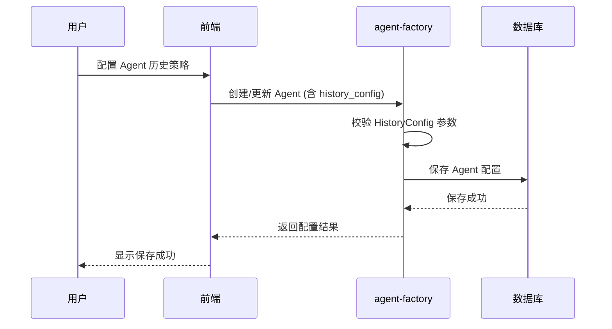
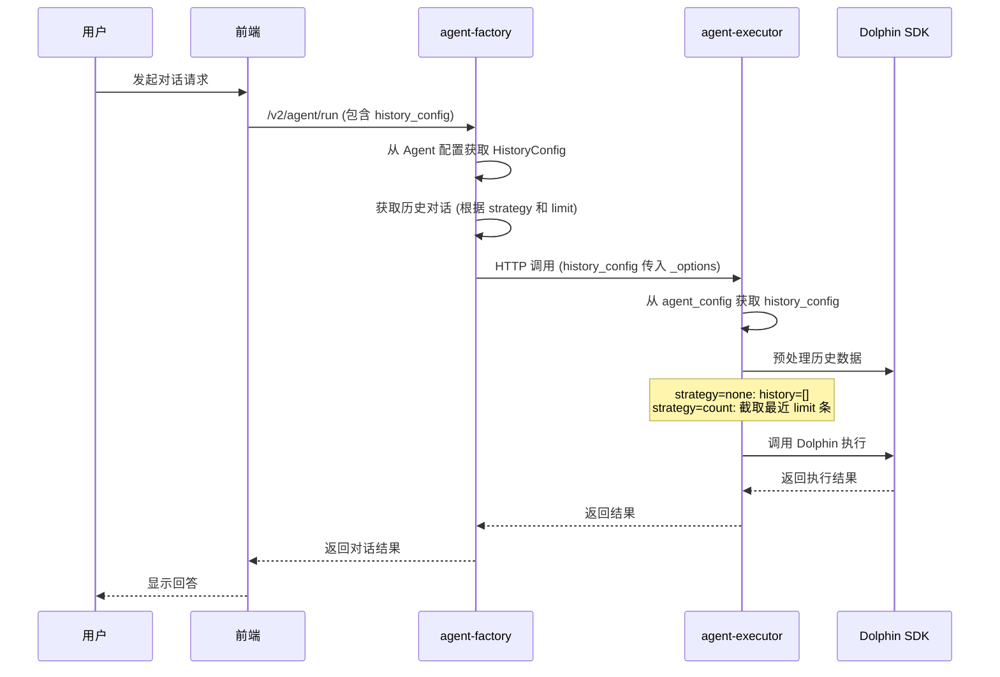
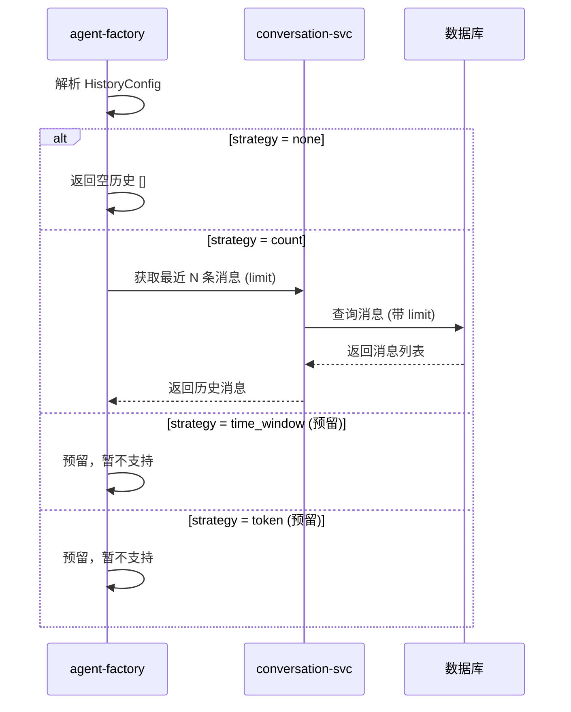

# 历史对话策略配置（HistoryConfig）设计文档

## 1. 背景

在当前 Agent 对话系统中，历史对话上下文的管理是一个重要的能力。系统需要支持以下场景：

1. **上下文长度控制**：当对话历史过长时，会导致 token 消耗增加、响应延迟提升，甚至超出 LLM 的上下文窗口限制
2. **灵活的历史策略**：不同业务场景需要不同的历史管理策略，例如部分场景需要完整历史，部分场景只需要最近的对话
3. **预留扩展能力**：未来需要支持基于时间窗口和 token 数量的历史策略

当前实现存在以下问题：
- 缺乏统一的历史配置结构，只能通过硬编码或简单参数控制
- 无法灵活配置不同策略
- 预留策略（时间窗口、token）的扩展性不足

---

## 2. 目标

### 2.1 核心目标

1. **提供统一的历史配置结构**：通过 `HistoryConfig` 对象统一管理历史对话策略
2. **支持多种历史策略**：
   - `none`：不获取历史对话
   - `count`：按消息数量限制（当前实现）
   - `time_window`：按时间窗口获取（预留）
   - `token`：按 token 数量限制（预留）
3. **前后端配置一致性**：确保 Agent 配置在创建、获取、运行时保持一致
4. **可扩展性设计**：预留策略字段使用指针类型，未设置时返回 `null`

### 2.2 非目标

- V1 版本不实现 `time_window` 和 `token` 策略的具体逻辑
- 不修改现有的对话存储结构

---

## 3. 目标用户和场景

### 3.1 目标用户

- **Agent 开发者**：需要在创建 Agent 时配置历史对话策略

### 3.2 场景

| 场景 | 策略 | 说明 |
|------|------|------|
| 简单问答 Agent | count (4-8条) | 只需要最近几轮对话作为上下文 |
| 长对话分析 Agent | count (16-20条) | 需要较多历史对话进行分析 |
| 无状态 Agent | none | 每次对话独立，不依赖历史 |
| 多轮任务 Agent | count (8-12条) | 需要保留足够上下文完成复杂任务 |
| 知识库问答 Agent | count (4条) | 主要是 RAG 场景，历史不需要太长 |

---

## 4. 产品规划

### 4.1 功能清单

| 功能 | 优先级 | 说明 |
|------|--------|------|
| HistoryConfig 数据结构 | P0 | 统一的历史配置结构定义 |
| count 策略实现 | P0 | 按消息数量限制历史 |
| none 策略实现 | P0 | 不获取历史 |
| time_window 策略（预留） | P1 | 预留字段，暂不实现 |
| token 策略（预留） | P1 | 预留字段，暂不实现 |
| 前端配置界面 | P2 | 仅提供后端能力，前端由业务方实现 |
| 配置校验 | P0 | 策略参数合法性校验 |

### 4.2 配置字段说明

```json
{
  "history_config": {
    "strategy": "count",           // 策略类型：none/count/time_window/token
    "limit": 8,                    // 消息数量限制（strategy=count时生效）
    "time_window": null,           // 时间窗口（单位：分钟，strategy=time_window时生效）
    "token_limit": null            // Token限制（strategy=token时生效）
  }
}
```

| 字段 | 类型 | 必填 | 默认值 | 说明 |
|------|------|------|--------|------|
| strategy | string | 是 | "count" | 历史策略：none/count/time_window/token |
| limit | int | 否 | 8 | 消息数量限制，范围0-20，0使用默认值 |
| time_window | int | 否 | null | 时间窗口（分钟），仅 time_window 策略使用 |
| token_limit | int | 否 | null | Token 数量限制，仅 token 策略使用 |

### 4.3 策略说明

| 策略 | 说明 | 参数 |
|------|------|------|
| none | 不获取历史对话，每次对话的 history=[] | 无 |
| count | 按消息数量获取最近 N 条对话 | limit |
| time_window | 按时间窗口获取历史对话（预留） | time_window |
| token | 按 token 数量限制历史（预留） | token_limit |

---

## 5. 时序图

### 5.1 Agent 创建/更新流程



### 5.2 Agent 运行流程（v2 版本）



### 5.3 历史数据获取流程（Factory 端）



---

## 6. API 变更

### 6.1 Agent 配置接口

#### 6.1.1 获取 Agent 配置

**请求路径**：`GET /v1/agent/config/{agent_id}`

**响应字段变更**：

```json
{
  "agent_config": {
    "input": {...},
    "system_prompt": "...",
    "history_config": {
      "strategy": "count",
      "limit": 8,
      "time_window": null,
      "token_limit": null
    }
  }
}
```

#### 6.1.2 创建/更新 Agent

**请求路径**：`POST /v1/agent/create` / `POST /v1/agent/update`

**请求体新增字段**：

```json
{
  "agent_config": {
    "input": {...},
    "system_prompt": "...",
    "history_config": {
      "strategy": "count",
      "limit": 8,
      "time_window": null,
      "token_limit": null
    }
  }
}
```

### 6.2 Agent 运行接口（v2）

#### 6.2.1 运行 Agent

**请求路径**：`POST /v2/agent/run`

**请求体新增字段**（通过 `_options` 传递）：

```json
{
  "agent_id": "xxx",
  "agent_version": "xxx",
  "agent_input": {
    "query": "用户问题"
  },
  "_options": {
    "history_config": {
      "strategy": "count",
      "limit": 8
    }
  }
}
```

### 6.3 Go 端代码变更

#### 6.3.1 ChatOption 定义变更

| 文件 | 变更 |
|------|------|
| `driveradapter/api/rdto/agent/req/chatopt/define.go` | `HistoryLimit int` → `HistoryConfig *daconfvalobj.HistoryConfig` |
| `drivenadapter/httpaccess/v2agentexecutoraccess/v2agentexecutordto/req.go` | `HistoryLimit int` → `HistoryConfig *daconfvalobj.HistoryConfig` |

#### 6.3.2 HistoryConfig 结构体

| 文件 | 说明 |
|------|------|
| `domain/valueobject/daconfvalobj/config.go` | 定义 HistoryConfig 结构体 |

```go
type HistoryConfig struct {
    Strategy   cdaenum.HistoryStrategy `json:"strategy"`
    Limit      int                     `json:"limit"`
    TimeWindow *int                    `json:"time_window"`  // 指针类型，未设置为 nil
    TokenLimit *int                    `json:"token_limit"`  // 指针类型，未设置为 nil
}
```

### 6.4 Python 端代码变更

#### 6.4.1 配置模型

| 文件 | 变更 |
|------|------|
| `app/domain/vo/agentvo/agent_config.py` | 添加 `history_config: Optional[Dict[str, Any]]` |
| `app/domain/vo/agentvo/agent_option.py` | `history_limit` → `history_config` |
| `app/config/config_v2/models/app_config.py` | 添加 `DEFAULT_HISTORY_LIMIT` 和 `MAX_HISTORY_LIMIT` |

#### 6.4.2 运行时处理

| 文件 | 变更 |
|------|------|
| `app/logic/agent_core_logic_v2/run_dolphin.py` | 读取 `history_config`，根据策略处理历史 |

---

## 7. 验收场景

### 7.1 配置创建与获取

| 场景 | 步骤 | 预期结果 |
|------|------|----------|
| 创建 Agent 时设置 history_config | 1. POST /v1/agent/create，传入 history_config<br/>2. GET /v1/agent/config/{id} | 配置正确保存并返回 |
| 不传 history_config 时使用默认值 | 1. POST /v1/agent/create，不传 history_config<br/>2. GET /v1/agent/config/{id} | 返回默认策略 `count`，`limit=8` |
| 设置 strategy=none | 1. 设置 history_config.strategy="none"<br/>2. 运行 Agent | 历史为空 |
| 设置 strategy=count, limit=5 | 1. 设置 history_config.strategy="count", limit=5<br/>2. 运行 Agent | 历史为最近5条消息 |
| 设置无效 limit 值 | 1. 设置 history_config.limit=-1 | 返回参数校验错误 |

### 7.2 运行时行为

| 场景 | 步骤 | 预期结果 |
|------|------|----------|
| count 策略正常工作 | 1. 配置 strategy="count", limit=3<br/>2. 有10条历史消息<br/>3. 运行 Agent | 只传递最近3条消息给 Dolphin |
| none 策略返回空历史 | 1. 配置 strategy="none"<br/>2. 有10条历史消息<br/>3. 运行 Agent | history=[]，不调用历史获取方法 |
| limit 超出实际消息数 | 1. 配置 strategy="count", limit=100<br/>2. 实际只有5条消息<br/>3. 运行 Agent | 返回全部5条消息，不报错 |
| limit=0 使用默认值 | 1. 配置 strategy="count", limit=0<br/>2. 运行 Agent | 使用默认值8条 |

### 7.3 预留策略处理

| 场景 | 步骤 | 预期结果 |
|------|------|----------|
| time_window 字段返回 null | 1. GET Agent 配置 | time_window 字段为 null（非 0） |
| token_limit 字段返回 null | 1. GET Agent 配置 | token_limit 字段为 null（非 0） |

### 7.4 边界情况

| 场景 | 步骤 | 预期结果 |
|------|------|----------|
| 旧版本 Agent 升级 | 1. 获取历史 Agent 配置（无 history_config）<br/>2. 运行 Agent | 自动使用默认策略 |
| history_config 传空对象 | 1. POST /v2/agent/run, _options.history_config={} | 使用默认策略 |
| history_config 传 null | 1. POST /v2/agent/run, _options.history_config=null | 使用 Agent 配置中的策略 |

---

## 8. 附录

### 8.1 相关文件路径

| 模块 | 文件路径 |
|------|----------|
| Go - HistoryConfig 定义 | `src/domain/valueobject/daconfvalobj/config.go` |
| Go - ChatOption | `src/driveradapter/api/rdto/agent/req/chatopt/define.go` |
| Go - V2 请求 DTO | `src/drivenadapter/httpaccess/v2agentexecutoraccess/v2agentexecutordto/req.go` |
| Go - 历史获取服务 | `src/domain/service/conversationsvc/get_history.go` |
| Python - AgentConfigVo | `app/domain/vo/agentvo/agent_config.py` |
| Python - 运行选项 | `app/domain/vo/agentvo/agent_option.py` |
| Python - 应用配置 | `app/config/config_v2/models/app_config.py` |
| Python - Dolphin 运行 | `app/logic/agent_core_logic_v2/run_dolphin.py` |

### 8.2 配置默认值

| 参数 | 默认值 | 最大值 |
|------|--------|--------|
| DEFAULT_HISTORY_LIMIT | 8 | 20 |
| MAX_HISTORY_LIMIT | 20 | - |

### 8.3 枚举值

| Strategy | 值 | 说明 |
|----------|-----|------|
| HistoryStrategyNone | "none" | 无历史 |
| HistoryStrategyCount | "count" | 按数量 |
| HistoryStrategyTimeWindow | "time_window" | 按时间窗口（预留） |
| HistoryStrategyToken | "token" | 按 Token（预留） |
